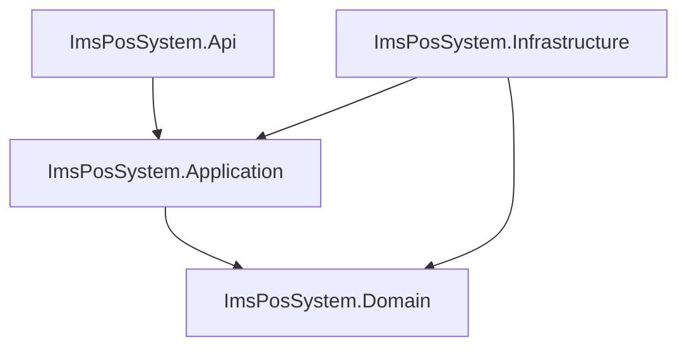

# ImsPosSystem — Production-Grade .NET Inventory & POS API

A high-performance, scalable backend solution built with **ASP.NET Core 9**, implementing **Clean Architecture**. This project provides a robust RESTful API covering the entire e-commerce and inventory domain—from product cataloging and warehouse management to transactional Point of Sale (POS) and purchasing workflows.

## Table of Contents
- [Architecture](#architecture)
- [Technology Stack](#technology-stack)
- [Project Structure](#project-structure)
- [Core Modules](#core-modules)
- [Design Patterns](#design-patterns)
- [Getting Started](#getting-started)
- [API Endpoints](#api-endpoints)
- [Error Handling](#error-handling)

---

## Architecture
The project strictly enforces **Clean Architecture** principles, ensuring that dependencies only point inward towards the Domain layer. This makes the system highly maintainable, testable, and decoupled from external frameworks.



- **Domain Layer**: Contains enterprise-wide logic, entities, and constants. Zero external dependencies.
- **Application Layer**: Houses business logic, service interfaces, DTOs, and mapping profiles.
- **Infrastructure Layer**: Implements data persistence (EF Core), repository patterns, and external services (Identity).
- **Presentation Layer (API)**: Entry point for the application, handling HTTP requests, middleware, and documentation.

---

## Technology Stack
| Category | Technology |
| :--- | :--- |
| **Framework** | ASP.NET Core 9.0 |
| **ORM** | Entity Framework Core (SQL Server) |
| **Authentication** | ASP.NET Core Identity + JWT Bearer Tokens |
| **Mapping** | AutoMapper |
| **Documentation** | Swagger / OpenAPI |
| **Logging** | Built-in Microsoft Logging |

---

## Project Structure
```text
ImsPosSystem
├── ImsPosSystem.Domain          # Core Entities, Constants, and Interfaces
├── ImsPosSystem.Application     # Business Logic, DTOs, Service Interfaces, Mappings
├── ImsPosSystem.Infrastructure  # EF Core, Identity, Repository Implementations, Migrations
└── ImsPosSystem.Api             # REST Controllers, Middleware, Configuration
```

---

## Core Modules

### 📦 Catalogue Module
Manage the heart of your inventory with a hierarchical product system.
- **Hierarchical Categorization**: Products grouped by Category and Subcategory.
- **Stock Tracking**: Real-time visibility into product levels across different locations.
- **Rich Metadata**: Comprehensive product details, pricing, and supplier associations.

### 🛒 Sales (POS) Module
Power your checkout experience with transactional sales management.
- **Invoicing**: Generate detailed sales invoices with itemized lines.
- **Stock Synchronization**: Automatically decrements inventory levels upon sale.
- **Calculated Totals**: Automatic tax and discount calculation logic.

### 🚛 Purchasing Module
Streamline your supply chain and supplier relationships.
- **Supplier Directory**: Manage contact details and payment history for all vendors.
- **Purchase Invoices**: Track incoming stock orders and their financial status.
- **Payment Tracking**: Record and manage payments made to suppliers.

### 🏢 Warehouse Module
Granular control over physical inventory dispersion.
- **Multi-Location Support**: Track stock across various warehouses or storage bins.
- **Stock Ledger**: A comprehensive audit trail (StockLedger) for every stock movement.
- **Inventory Adjustments**: Manual corrections and stock transfers between locations.

### 📊 Reporting & Dashboard
Actionable insights driven by real-time data.
- **Business KPIs**: High-level summaries of total sales, revenue, and stock value.
- **Stock Alerts**: Automatic notification for products below reorder thresholds.
- **Sales Trends**: Longitudinal analysis of sales performance.

---

## Design Patterns

### 🧬 Generic Repository Pattern
The system utilizes a `GenericRepository<TEntity, TKey>` to abstract the underlying data access logic. This promotes code reuse and ensures a consistent interface for managing different entities across the Application layer.

### 🧵 Unit of Work Pattern
All repository operations are coordinated through a `UnitOfWork` instance. This ensures that multiple repository changes within a single business transaction are committed atomically, maintaining data integrity even in complex flows.

### 🛡️ Global Exception Handling
A custom `GlobalExceptionMiddleware` catches all unhandled exceptions and transforms them into standardized JSON responses following the **ProblemDetails** pattern. This ensures the API remains robust and provides meaningful feedback to consumers without leaking sensitive system details.

---

## Getting Started

### Prerequisites
- **.NET 9 SDK**
- **SQL Server** (LocalDB or Express)
- **Visual Studio 2022** or **VS Code**

### Configuration
1. Clone the repository:
   ```bash
   git clone <repository-url>
   ```
2. Update the connection string in `ImsPosSystem.Api/appsettings.json`:
   ```json
   {
     "ConnectionStrings": {
       "DefaultConnection": "Server=YOUR_SERVER;Database=ImsPosSystem;Trusted_Connection=True;"
     },
     "JWT": {
       "Key": "Your_Super_Secret_Key_At_Least_32_Chars",
       "Iss": "https://localhost:5001",
       "Aud": "https://localhost:5001"
     }
   }
   ```

### Execution
Run the API from the root directory:
```bash
cd ImsPosSystem.Api
dotnet run
```
The API will be available at `https://localhost:5001` (or your configured port). You can access the interactive documentation at `https://localhost:5001/swagger`.

---

## API Endpoints

### 🔐 Authentication
| Method | Endpoint | Access | Description |
| :--- | :--- | :--- | :--- |
| `POST` | `/api/account/register` | Public | Register a new application user. |
| `POST` | `/api/account/login` | Public | Authenticate and receive a JWT token. |

### 📋 Catalogue & Inventory
| Method | Endpoint | Access | Description |
| :--- | :--- | :--- | :--- |
| `GET` | `/api/products` | Admin, Cashier | List all products with stock info. |
| `GET` | `/api/products/{id}` | Admin, Cashier | Get detailed product information. |
| `GET` | `/api/categories` | Admin, Cashier | List all product categories. |

### 💳 Sales (POS)
| Method | Endpoint | Access | Description |
| :--- | :--- | :--- | :--- |
| `POST` | `/api/sales` | Cashier, Admin | Process a new sale (decrements stock). |
| `GET` | `/api/sales` | Admin | Retrieve sales history. |
| `GET` | `/api/sales/{id}` | Admin | Get details of a specific sale. |

### 🚛 Purchasing & Suppliers
| Method | Endpoint | Access | Description |
| :--- | :--- | :--- | :--- |
| `POST` | `/api/purchases` | Admin | Record a new purchase from a supplier. |
| `GET` | `/api/suppliers` | Admin | List all registered suppliers. |

### 📊 Dashboard & Analytics
| Method | Endpoint | Access | Description |
| :--- | :--- | :--- | :--- |
| `GET` | `/api/dashboard/summary` | Admin | High-level business KPIs. |
| `GET` | `/api/dashboard/stock-alerts` | Admin | Low-stock notifications. |
| `GET` | `/api/dashboard/sales-trend` | Admin | Monthly sales trend data. |

---

## Error Handling
All API responses follow a consistent error format. When a request fails, the API returns an appropriate HTTP status code along with a JSON body:

```json
{
  "error": "Resource not found",
  "statusCode": 404
}
```

### Common Status Codes
- `400 Bad Request`: Validation errors or business rule violations.
- `401 Unauthorized`: Missing or invalid JWT token.
- `403 Forbidden`: Insufficient role permissions.
- `404 Not Found`: The requested resource does not exist.
- `500 Internal Server Error`: An unexpected system error occurred.

---
